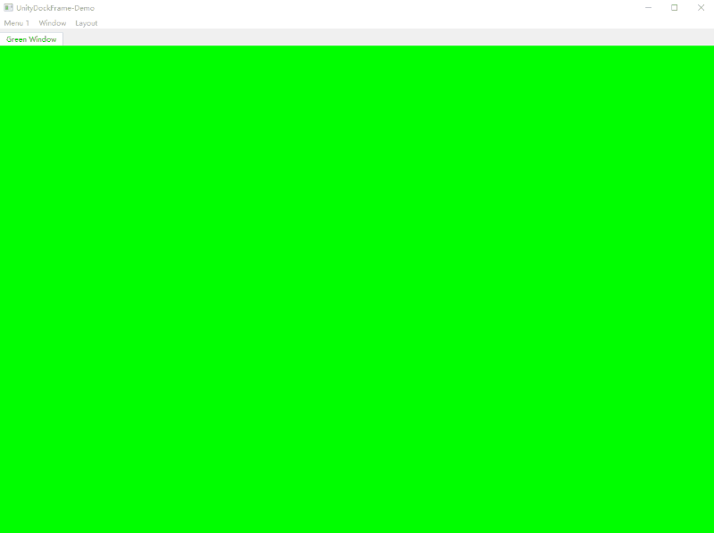

## 语言
- [英文](README.md)
- [简体中文](README.zh.md)（默认）

# UnityDockFrame

## 项目概述

UnityDockFrame是一个基于Qt框架开发的可停靠窗口系统，实现了类似Unity编辑器风格的界面布局功能，允许用户根据个人工作流程自由调整界面布局。



## 功能特点

UnityDockFrame借鉴了Unity编辑器停靠系统的设计理念，基于Qt框架实现了功能完备的可停靠窗口系统，主要特点包括：

- **灵活的窗口管理**
  - 支持窗口拖拽停靠到容器的不同位置（上、下、左、右、中央区域）
  - 支持窗口浮动和最大化操作
  - 标签式窗口布局，支持快速切换
  - 提供可自定义的窗口上下文菜单

- **强大的布局系统**
  - 基于自定义Splitter的灵活分割布局
  - 支持将布局保存为JSON格式文件
  - 支持从JSON文件加载布局
  - 可固定布局，防止意外拖拽修改
  - 重启后自动恢复上次布局

- **便捷的窗口工厂机制**
  - 提供工厂模式用于窗口注册和创建
  - 支持静态和动态窗口注册
  - 支持唯一实例窗口（单例模式）

- **良好的扩展性**
  - 提供`DockableWindow`基类用于自定义窗口开发
  - 支持窗口类型ID标识，方便管理和查找
  - 支持窗口状态的保存和恢复

该项目适用于需要灵活界面布局的Qt应用程序开发，如IDE、图像编辑器、数据分析工具等。

## UnityDockFrame-Demo示例介绍

UnityDockFrame-Demo是一个使用UnityDockFrame库的示例应用，展示了如何创建和使用可停靠窗口系统。

### 功能说明

- **菜单系统**
  - 提供"菜单1"和"窗口"菜单
  - "窗口"菜单列出所有注册的窗口类型
  - "布局"菜单提供布局管理功能（布局1、布局2、保存布局、打开布局、默认布局、固定布局）

- **示例窗口**
  - 实现了多种颜色的窗口（BlackWindow、BlueWindow、GreenWindow、RedWindow、CyanWindow）
  - 每个窗口都是`DockableWindow`的子类
  - 展示了如何注册和使用可停靠窗口

- **布局管理**
  - 启动时自动加载上次保存的布局
  - 退出时自动保存当前布局
  - 支持在多种预定义布局之间切换
  - 支持固定布局，防止拖拽修改

### 如何运行

1. 使用Qt Creator打开`UnityDockFrame-Demo.pro`文件
2. 编译并运行项目
3. 在"窗口"菜单中选择不同的窗口类型创建窗口
4. 拖拽窗口进行停靠、浮动等操作
5. 使用"布局"菜单管理窗口布局

## Dock库API使用方法

### 1. 创建可停靠窗口

要创建一个可停靠窗口，需要继承`DockableWindow`类：

```cpp
#include "DockableWindow.h"

class MyWindow : public dock::DockableWindow
{
    Q_OBJECT
public:
    MyWindow(QWidget *parent = nullptr);
    ~MyWindow();
    
    // 可选：重写这些方法以实现自定义功能
    virtual void onFloating() override;        // 窗口浮动时调用
    virtual void onDocking() override;        // 窗口停靠时调用
    virtual void onContextMenu(QMenu* menu) override;  // 上下文菜单
    virtual bool canClose() override;         // 是否可以关闭窗口
    virtual bool load(const QJsonObject &jsonObj) override;  // 加载窗口状态
    virtual void saveObject(QJsonObject &jsonObj) override;   // 保存窗口状态
    virtual QString getTitle() override;      // 获取窗口标题
};
```

### 2. 注册窗口

有两种方式注册窗口：静态注册和动态注册。

#### 静态注册

使用`STATIC_REGISTER_WINDOW`宏在头文件中注册窗口：

```cpp
// 在MyWindow.h文件末尾
STATIC_REGISTER_WINDOW(MyWindow, "我的窗口", true)  // 参数：类名，窗口标题，是否唯一实例
```

#### 动态注册

首先使用`DEC_WINDOW_FACTORY`宏声明窗口工厂，然后在代码中调用`REGISTER_WINDOW`宏注册：

```cpp
// 在MyWindow.h文件中
DEC_WINDOW_FACTORY(MyWindow, "我的窗口", true)

// 在main.cpp或其他适当位置
REGISTER_WINDOW(MyWindow)
```

### 3. 使用DockContainer

`DockContainer`是停靠系统的核心容器，用于管理所有可停靠窗口：

```cpp
#include "DockContainer.h"

// 创建主窗口
QMainWindow *mainWindow = new QMainWindow();
mainWindow->setCentralWidget(new QWidget());

// 创建DockContainer
DockContainer *container = new DockContainer(mainWindow->centralWidget());

// 创建并显示窗口
uint windowTypeId = qHash(QString("MyWindow"));
container->floatView(windowTypeId);  // 创建浮动窗口
// 或
container->activeView(windowTypeId);  // 创建或激活已有窗口
```

### 4. 布局管理

```cpp
// 保存布局到JSON文件
QFile file("layout.json");
if (file.open(QIODevice::WriteOnly)) {
    QJsonObject jsonObj;
    container->saveLayoutToJson(jsonObj);
    QJsonDocument doc(jsonObj);
    file.write(doc.toJson());
    file.close();
}

// 从JSON文件加载布局
QFile file("layout.json");
if (file.open(QIODevice::ReadOnly)) {
    QByteArray data = file.readAll();
    QJsonDocument doc(QJsonDocument::fromJson(data));
    QJsonObject jsonObj = doc.object();
    container->createLayoutFromJson(jsonObj);
    file.close();
}

// 初始化默认布局
container->initLayout();

// 启用/禁用拖拽功能
container->enableDrag(true);  // 启用拖拽
container->enableDrag(false); // 禁用拖拽（固定布局）
```

### 5. 窗口工厂管理

```cpp
// 获取窗口工厂管理器实例
WindowFactoryManager *manager = WindowFactoryManager::getInstance();

// 获取所有注册的窗口工厂
const std::map<uint, WindowFactory *> &factories = manager->getAllFactorys();

// 根据窗口类型ID获取窗口工厂
WindowFactory *factory = manager->getFactory(windowTypeId);

// 创建窗口实例
DockableWindow *window = factory->create(parentWidget);
```

## 编译和运行

### 环境要求

- Qt 5.0 或更高版本
- C++11 或更高版本编译器

### 编译步骤

1. 使用Qt Creator打开`DockFrame.pro`文件
2. 选择构建配置（Debug或Release）
3. 编译整个项目

### 运行示例

编译完成后，直接运行UnityDockFrame-Demo项目即可看到示例应用。

## 许可证

本项目采用[MIT许可证](LICENSE)，可自由使用、修改和分发。

## 作者

崔志雷

## 版本v

当前版本：1.0.0

发布日期：2017年4月

## 赞助支持

如果您觉得本项目对您有帮助，欢迎通过微信或支付宝进行赞助支持：


感谢您的支持与鼓励！